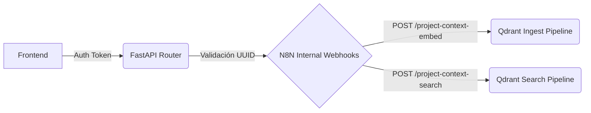

# Integración Backend (RAG & Semantic Context)

La estrategia general es mantener a FastAPI como el **Gateway Autorizado y Sincrónico**, delegando el procesado pesado y la orquestación a N8n y Microservicios Locales. 

## Arquitectura de Flujo (Gateway Proxy)

El Frontend nunca se comunicará directamente con Qdrant ni con n8n de manera aislada por razones de seguridad (inyección cruzada de `project_id`).



## Cambios Mínimos Propuestos en Backend

Para soportar las lecturas/escrituras al sistema semántico sugerimos crear los siguientes 3 bloques en `apps/api/src`:

### 1. Schemas de Contrato (`apps/api/src/schemas/context.py`)
Manejo tipado Pydantic estricto para garantizar que nada que llegue a N8n esté corrupto.
```python
from pydantic import BaseModel
from typing import Optional

class ContextIngestRequest(BaseModel):
    project_id: str
    entity_type: str  # ej. "shot_note", "director_guidance"
    title: str
    content: str
    tags: list[str] = []
    sequence_id: Optional[str] = None
    scene_id: Optional[str] = None
    shot_id: Optional[str] = None
    source: str = "editorial_ui"

class ContextSearchRequest(BaseModel):
    query: str
    limit: int = 5
    filter: Optional[dict] = None
```

### 2. Servicio Base (`apps/api/src/services/semantic_service.py`)
Un wrapper sencillo que envuelva llamadas HTTP (`httpx.AsyncClient` o equivalente) dirigidas hacia el dominio de n8n dentro del container bridge (usando `$N8N_WEBHOOK_URL` exportado en las `.env.private`).

### 3. Endpoints (`apps/api/src/routes/context.py`)
Dos rutas limpias y explícitas, inyectadas al Router principal con validación JWT:
- **`POST /api/v1/context/ingest`**: Consume `ContextIngestRequest`, valida permisos sobre el Project, y disptacha asíncronamente a N8n sin bloquear a la UI.
- **`POST /api/v1/context/search`**: Consume `ContextSearchRequest`, sobrescribe/forza la llave `filter` de los tenants de Qdrant inyectando imperativamente el `project_id` del usuario (evitando filtraciones), dispara peticion sincrona a N8n y devuelve el JSON final mapeado al frontend.
