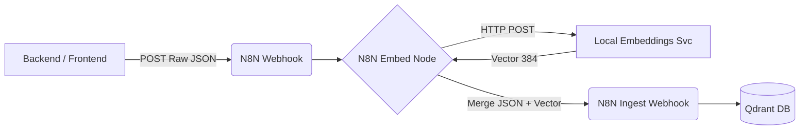

# Embeddings Workflow Integration 

Este documento explica cómo fluyen los datos semánticos desde que un usuario añade una nota hasta su inserción en el motor vectorial Qdrant.

## Flujo de Orquestación



## Contrato de Datos (N8N Entrypoint)

La API O el Frontend deben apuntar al webhook intermedio **`POST /webhook/project-context-embed`**, nunca directamente a Qdrant y nunca directamente al Ingest Webhook (que carece de motor embedder).

**Payload Ejemplo:**
```json
{
  "project_id": "214f4...",
  "sequence_id": "seq-10",
  "scene_id": "scene-50",
  "shot_id": null,
  "entity_type": "shot_note",
  "title": "Corrección de Continuidad",
  "content": "La bufanda roja debe verse deshilachada en este toma.",
  "tags": ["wardrobe", "continuity"],
  "source": "editorial_ui"
}
```

## Comportamiento del Pipeline

1. **`02 - Project Context Embed Pipeline`**: Recibe el JSON y aísla el campo `content`. Hace una llamada a `$env.EMBEDDINGS_URL` (por defecto `http://host.docker.internal:8000/embed`).
2. Recibe el listado de 384 flotantes.
3. Lo anexa estáticamente al cuerpo original JSON introduciendo la key `"vector": [...]`.
4. Rebota el request al flujo previamente configurado y ya finalizado cerrado **`03 - Project Context Ingest`** (`http://localhost:5678/webhook/project-context-ingest`).
5. Transfiere de vuelta hacia el frontend/API el acuse de recibo de Qdrant.
