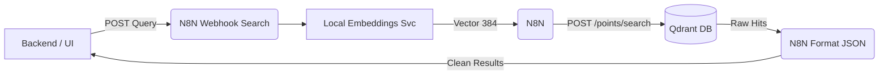

# Retrieval Workflow Integration

Este documento expone cómo se recupera y filtra el conocimiento semántico inyectado previamente en Qdrant vía N8N, manteniendo la arquitectura asíncrona intocable.

## Flujo de Búsqueda (RAG)



## Contrato de Datos (N8N Entrypoint)

La API o el Frontend realizarán una petición al webhook intermedio **`POST /webhook/project-context-search`**.

**1. Payload Básico (Solo búsqueda Semántica)**
```json
{
  "query": "Busco planos detallados oscuros y de cámara baja",
  "limit": 3
}
```

**2. Payload Avanzado (Semántica + Filtrado Estricto de Qdrant)**
Si el usuario está dentro del "Project A" en la interfaz, el backend DEBE asegurar que los resultados solo pertenezcan a ese `project_id`. El nodo acepta queries de filtrado nativo de Qdrant directo en el JSON.

```json
{
  "query": "Vestimenta desgastada en personajes principales",
  "limit": 5,
  "filter": {
    "must": [
      {
        "key": "project_id",
        "match": { "value": "project-001" }
      },
      {
        "key": "entity_type",
        "match": { "value": "shot_note" }
      }
    ]
  }
}
```

## Comportamiento del Pipeline (`04 - Project Context Retrieval`)

1. **Recibe la frase en texto plano:** Petición HTTP cruda hacia n8n.
2. **Generación del Vector de Consulta:** N8n invoca al microservicio local (FastEmbed) para transmutar el String `"Vestimenta desgastada..."` en un Float Array de `384` dimensiones. Esto iguala la matemática con la base guardada con compatibilidad exacta del 100%.
3. **Inersección Simétrica Espacial:** La base vectorial recupera del Clúster de manera atómica todos los vectores con mayor similitud (Cosine Distance).
4. **Respuesta Formateada:** N8n limpia los metadatos inútiles y devuelve al backend un array ordenado de mayor a menor `score` para usar la data contextual en prompts o renders futuros de la app de UI.
