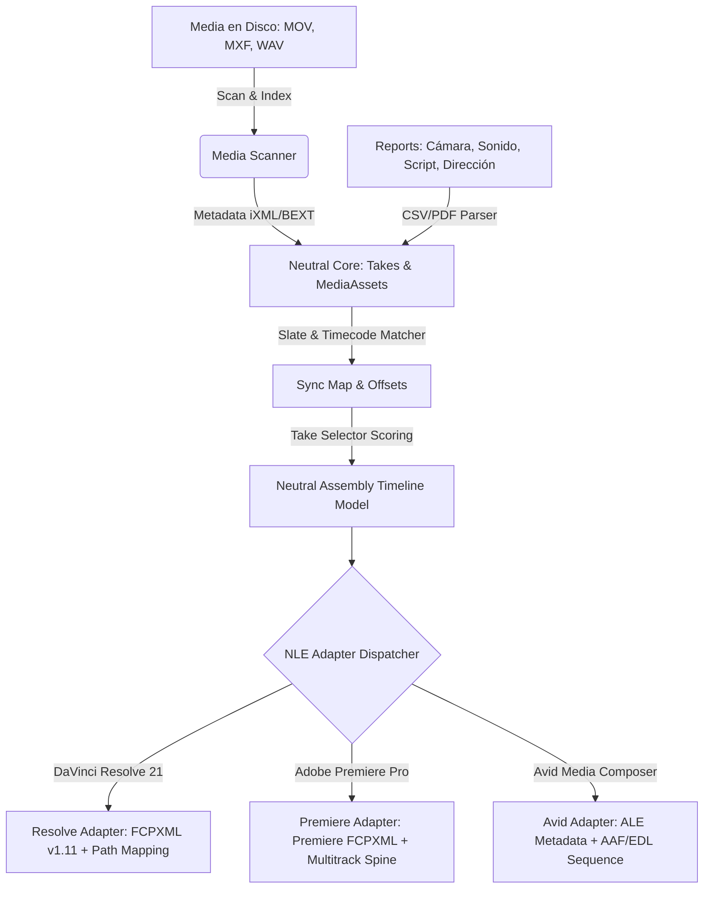

# CID Editorial Assembly: Multi-NLE Technical Architecture

Este documento detalla la arquitectura técnica para expandir el módulo de montaje preliminar inteligente de CID (**Editorial Assembly**) desde una solución enfocada principalmente en DaVinci Resolve a un motor neutral con adaptadores y exportadores específicos para los tres principales sistemas de edición no lineal (NLE) de la industria cinematográfica: **DaVinci Resolve 21**, **Adobe Premiere Pro** y **Avid Media Composer**.

---

## 1. Visión Funcional

**CID Editorial Assembly** actúa como el puente de datos inteligente entre la preproducción (guion, secuencias, storyboard) y la postproducción real. 
El sistema lee de manera no invasiva la media física rodada en disco y la cruza con los reportes de rodaje de los diferentes departamentos (Script, Cámara, Sonido, Dirección) para:

1. **Indexar y Conciliar**: Identificar qué archivo de video y audio corresponde a cada secuencia, plano y toma.
2. **Sincronizar Audio (Dual-System)**: Enlazar el audio multipista directo (BWF/iXML) con el video de cámara correspondiente calculando las discrepancias de timecode (offsets).
3. **Seleccionar las Mejores Tomas**: Puntuación automatizada y selección de las tomas marcadas como válidas ("circled takes") o preferidas por dirección/script.
4. **Construir el Premontaje (Assembly Timeline)**: Generar una secuencia lineal basada en el guion con las tomas seleccionadas.
5. **Exportar a NLEs**: Generar los paquetes de metadatos, bandejas (bins), marcadores de notas y líneas de tiempo iniciales listos para importar directamente en Resolve, Premiere o Avid sin pérdida de información de sincronización y con reportes detallados de material faltante.

---

## 2. Flujo de Datos General

La siguiente secuencia ilustra cómo fluyen los metadatos desde el disco y la producción hasta los NLEs objetivo:



---

## 3. Arquitectura Core / Adapters

Para evitar un acoplamiento estrecho con DaVinci Resolve, el sistema se divide en dos capas claramente diferenciadas:

### A. Editorial Assembly Core (Motor Neutral)
- **Media Scanner / Path Resolver**: Escanea directorios locales o de red, lee las cabeceras de metadatos (Timecode, FPS, Reels, Chunks BEXT/iXML en WAV) y guarda referencias en la base de datos sin mover ni duplicar archivos pesados.
- **Report Ingest & Parser**: Mapea reportes de rodaje externos a entidades estructuradas independientes del NLE.
- **Slate/Timecode Matcher**: Algoritmo de unificación que asocia el video de cámara con el audio externo buscando coincidencias exactas o aproximadas de claqueta (`Scene_Shot_Take`), metadatos embebidos iXML, códigos de tiempo coincidentes o patrones de nombres.
- **Take Selector & Scoring**: Clasifica las tomas según criterios de calidad artística (notas de dirección) e integridad técnica (calidad del audio, foco de cámara).
- **Internal Assembly Timeline Model**: Modelo relacional intermedio que representa la secuencia de edición: pistas de video, pistas de audio vinculadas, offsets de sincronización, orden en el timeline y marcadores.
- **Relink Report Generator**: Motor de resolución de rutas relativas que re-mapea los URIs de archivos de acuerdo con el sistema operativo y ruta de destino (Windows, macOS, Linux).

### B. Export Adapters (NLE Specific)
- **Resolve 21 Exporter**: Genera archivos **FCPXML** (versión 1.10/1.11) estructurados con colecciones de recursos (`resources`), metadatos en notas (`note`) y referencias de tracks sincrónicos compatibles con la base de datos local de Resolve. Soporta empaquetado zip multiplataforma.
- **Premiere Exporter**: Genera archivos **FCPXML / XML de Premiere** optimizados. Aunque Premiere importa FCPXML estándar, tiene requerimientos estrictos para la asignación de pistas de audio multipista externas y la importación de marcadores de timeline.
- **Avid Exporter**: Avid Media Composer no importa FCPXML. Por lo tanto, este adaptador genera:
  1. **ALE (Avid Log Exchange)**: Archivo de texto tabulado que importa toda la metadata rica (Scene, Take, Script notes, Director notes, Sync status) directamente a la bandeja (bin) de Avid vinculando los master clips.
  2. **AAF (Advanced Authoring Format) / EDL (Edit Decision List)**: Secuencia base de corte para reconstruir el timeline inicial.

---

## 4. Módulos y Servicios Reutilizables

CID ya cuenta con una base sólida de servicios editoriales que se pueden reutilizar en el diseño multi-NLE:

1. **[audio_metadata_service.py](file:///opt/SERVICIOS_CINE/src/services/audio_metadata_service.py)**: Parser de archivos WAV BWF para extraer chunks `bext` e `iXML` (timecode, escena, toma, circled).
2. **[editorial_reconciliation_service.py](file:///opt/SERVICIOS_CINE/src/services/editorial_reconciliation_service.py)**: Algoritmo de conciliación de material. Cruza reports de script, dirección, cámara y sonido con media indexada basándose en jerarquías de confianza (exacta, ixml, slate, roll, filename, timecode).
3. **[take_scoring_service.py](file:///opt/SERVICIOS_CINE/src/services/take_scoring_service.py)**: Puntuación de tomas basada en calidad artística/técnica y etiquetado automático de tomas recomendadas (`is_recommended`).
4. **[assembly_service.py](file:///opt/SERVICIOS_CINE/src/services/assembly_service.py)**: Generador del modelo de datos de corte preliminar (`AssemblyCut` y `AssemblyCutItem`).
5. **[media_path_resolver_service.py](file:///opt/SERVICIOS_CINE/src/services/media_path_resolver_service.py)**: Conversión de rutas lógicas a rutas físicas/URIs del sistema de archivos.
6. **[davinci_platform_package_service.py](file:///opt/SERVICIOS_CINE/src/services/davinci_platform_package_service.py)**: Mapeo multiplataforma de URIs de archivos de media (`file:///` para Windows, macOS y Linux) para evitar clips offline al mover el proyecto FCPXML a estaciones de trabajo externas.

---

## 5. Huecos Técnicos (Technical Gaps)

Para alcanzar el soporte multi-NLE real, se deben resolver las siguientes carencias del sistema actual:

1. **Falta de Exportador AAF / EDL**: Avid Media Composer y Premiere Pro (en flujos tradicionales) requieren EDL para conformar secuencias si no se usa FCPXML. Se necesita un motor que serialice el timeline neutral a formato CMX 3600 EDL estándar.
2. **Falta de Generador ALE**: No existe un parser/generador de archivos **Avid Log Exchange (ALE)**. Avid requiere esto para popular las columnas del Bin (Scene, Take, Tape, Notes, Circled) antes de la edición.
3. **Sincronización de Audio Multipista en Premiere/Resolve**: El FCPXML experimental actual genera un track de audio simple (`track type="audio"`). Para flujos profesionales, Premiere Pro requiere que los sub-clips o clips agrupados sincrónicos mapeen múltiples canales de audio (ej: canal 1 lavalier, canal 2 boom) mapeados a pistas específicas del timeline de destino.
4. **Parser unificado de Reportes**: Aunque CID tiene modelos de datos para reports, la ingesta física de reports (CSV/PDF de cámaras ARRI/RED, reportes de sonido Sound Devices) no está completamente integrada en los endpoints editoriales actuales.

---

## 6. Schemas Propuestos (Pydantic)

Los siguientes modelos enriquecerán la API para soportar el flujo neutral y los adaptadores específicos:

```python
from pydantic import BaseModel, Field
from typing import Any, Optional
from datetime import datetime

# --- Capa de Ingesta y Análisis ---

class EditorialMediaAsset(BaseModel):
    id: str
    file_name: str
    file_path: str
    asset_type: str  # "video", "audio"
    duration_frames: int
    fps: float
    start_timecode: str
    end_timecode: Optional[str] = None
    channels: Optional[int] = None
    sample_rate: Optional[int] = None
    camera_roll: Optional[str] = None
    sound_roll: Optional[str] = None

class CameraReportEntry(BaseModel):
    card_or_mag: str
    clip_name: str
    scene: int
    shot: int
    take: int
    fps: float
    lens: Optional[str] = None
    aperture: Optional[str] = None
    notes: Optional[str] = None

class SoundReportEntry(BaseModel):
    sound_roll: str
    file_name: str
    scene: int
    take: int
    timecode_start: str
    tracks_count: int
    notes: Optional[str] = None

class ScriptSupervisorNote(BaseModel):
    scene_number: int
    shot_number: int
    take_number: int
    is_circled: bool
    continuity_notes: Optional[str] = None
    editor_note: Optional[str] = None

class DirectorNote(BaseModel):
    scene_number: int
    shot_number: int
    take_number: int
    is_preferred: bool
    intention_note: Optional[str] = None
    pacing_note: Optional[str] = None

# --- Capa de Conciliación y Sincronización ---

class SlateMatch(BaseModel):
    scene_number: int
    shot_number: int
    take_number: int
    confidence: float  # 0.0 a 1.0
    matching_method: str  # "exact_match", "xml_metadata", "timecode_near", etc.
    warnings: list[str]

class SyncCandidate(BaseModel):
    audio_asset_id: str
    audio_filename: str
    timecode_offset_frames: int
    sync_confidence: float
    sync_method: str

class TakeDecision(BaseModel):
    take_id: str
    scene_number: int
    shot_number: int
    take_number: int
    score: float
    is_recommended: bool
    recommended_reason: str
    camera_asset_id: Optional[str] = None
    sound_asset_id: Optional[str] = None

# --- Capa de Timeline Neutral ---

class AssemblyClip(BaseModel):
    id: str
    take_id: str
    clip_name: str
    source_media_asset_id: str
    audio_media_asset_id: Optional[str] = None
    timeline_in: int
    timeline_out: int
    duration_frames: int
    fps: float
    start_tc: str
    timecode_offset_frames: int = 0
    assigned_tracks: list[str] = ["V1", "A1"]

class AssemblySequence(BaseModel):
    id: str
    name: str
    scene_number: int
    clips: list[AssemblyClip]

class AssemblyTimeline(BaseModel):
    id: str
    project_id: str
    name: str
    fps: float
    total_duration_frames: int
    sequences: list[AssemblySequence]

# --- Capa de Exportación ---

class NLEExportRequest(BaseModel):
    nle_type: str = Field(..., description="resolve, premiere, avid")
    audio_mode: str = Field("conservative", description="conservative, linked_multitrack")
    target_platform: str = Field("windows", description="windows, mac, linux, offline")
    destination_root_path: Optional[str] = None
    include_relink_report: bool = True

class NLEExportResult(BaseModel):
    nle_type: str
    export_format: str  # "fcpxml", "xml", "aaf", "edl", "ale"
    file_name: str
    file_bytes_b64: str
    warnings: list[str]
    manifest: dict[str, Any]

class RelinkReport(BaseModel):
    resolved_media_count: int
    offline_media_count: int
    missing_media_count: int
    path_mappings: dict[str, str]

class MissingMediaReport(BaseModel):
    clip_name: str
    role: str  # "video", "audio"
    expected_filename: str
    scene: int
    shot: int
    take: int
```

---

## 7. Endpoints Propuestos

Los endpoints propuestos modelan el flujo de trabajo secuencial en CID para estructurar el premontaje:

### 1. Escaneo e Indexación de Media
* **POST** `/api/projects/{id}/editorial/scan-media`
  * **Descripción**: Lee de manera no destructiva el directorio de media especificado en el cuerpo. Indexa metadatos y crea los registros de `MediaAsset`.
  * **Input**:
    ```json
    {
      "root_directory_path": "/opt/storage/proyecto_cine/media",
      "recursive": true
    }
    ```
  * **Output**: `list[EditorialMediaAsset]` + métricas de archivos procesados.

### 2. Importación de Reportes Editoriales
* **POST** `/api/projects/{id}/editorial/import-reports`
  * **Descripción**: Ingiere y parsea los informes de Script, Cámara, Sonido o Dirección en formatos CSV/JSON/PDF.
  * **Input**: FormData con archivos y `report_type` ("camera", "sound", "script", "director").
  * **Output**: Confirmación de entradas creadas (`CameraReportEntry`, `SoundReportEntry`, etc.).

### 3. Conciliación y Sincronización
* **POST** `/api/projects/{id}/editorial/match-takes`
  * **Descripción**: Ejecuta el algoritmo de conciliación. Asocia clips de video con audio multipista BWF/iXML y reportes, generando o actualizando las entidades `Take` y sus offsets de sincronía.
  * **Input**: Opciones de heurística de sincronización y tolerancias de timecode.
  * **Output**: Resumen de tomas resueltas, conflictos y `list[SlateMatch]`.

### 4. Construcción del Premontaje Neutral
* **POST** `/api/projects/{id}/editorial/build-assembly`
  * **Descripción**: Genera una línea de tiempo neutral interna (`AssemblyTimeline`) utilizando únicamente las tomas puntuadas como óptimas por el motor de scoring.
  * **Input**:
    ```json
    {
      "selection_criteria": "highest_score",
      "allow_missing_audio": true
    }
    ```
  * **Output**: `AssemblyTimeline` estructurado.

### 5. Exportadores Específicos
* **POST** `/api/projects/{id}/editorial/export/resolve`
  * **Descripción**: Exporta el timeline neutral a un paquete FCPXML v1.11 con perfiles de ruta específicos de DaVinci Resolve.
  * **Input**: `NLEExportRequest`
  * **Output**: `NLEExportResult` (contiene el FCPXML final).

* **POST** `/api/projects/{id}/editorial/export/premiere`
  * **Descripción**: Exporta un archivo FCPXML compatible con Premiere Pro con enrutamiento de pistas de audio multipista en paralelo.
  * **Input**: `NLEExportRequest`
  * **Output**: `NLEExportResult`.

* **POST** `/api/projects/{id}/editorial/export/avid`
  * **Descripción**: Exporta un paquete para Avid conteniendo el archivo ALE (metadata del Bin) y el EDL o AAF preliminar para conformar el timeline.
  * **Input**: `NLEExportRequest`
  * **Output**: Archivo comprimido `.zip` con el ALE, el EDL y el reporte de Relink.

* **GET** `/api/projects/{id}/editorial/reports/{report_type}`
  * **Descripción**: Descarga los reportes consolidados (Media Relink, Clips Faltantes o Tomas Descartadas).
  * **Output**: JSON o CSV según el query parameter `format`.

---

## 8. NLE Adapters & Formatos de Exportación

| NLE Objetivo | Formato Primario | Formato Secundario | Estructura de Bins | Soporte Multipista | Marcadores |
|---|---|---|---|---|---|
| **DaVinci Resolve 21** | FCPXML v1.10/1.11 | EDL | Automática (Events a Bins) | Linkado simple en Spine | Tags `<note>` en Clip |
| **Adobe Premiere Pro** | Premiere FCPXML | EDL | Automática (Mapeo XML) | Canales paralelos en Spine | Marcadores XML nativos |
| **Avid Media Composer** | ALE (Metadatos) | EDL CMX 3600 | Manual vía ALE Import | Tracks definidos en EDL | Metadata en Bin |

---

## 9. Limitaciones Técnicas y de Formato por NLE

1. **Avid Media Composer y AAF**:
   * *Limitación*: Crear archivos AAF binarios desde Python es propenso a errores debido al formato propietario estructurado de Microsoft (Structured Storage).
   * *Mitigación*: Se utilizará **EDL CMX 3600** para la secuencia física y **ALE (Avid Log Exchange)** para los metadatos y enrutamiento en los Bins de Avid. Esta combinación es el estándar clásico en flujos de trabajo profesionales.
2. **Premiere Pro y Timecode Offsets en XML**:
   * *Limitación*: Premiere a veces interpreta erróneamente el inicio (`start`) de un clip en FCPXML si los ratios de FPS no coinciden exactamente con la base de tiempo de la secuencia.
   * *Mitigación*: El Premiere Adapter normalizará estrictamente el frame duration a fracciones comunes (`1/24s`, `1001/30000s`) y calculará los offsets en base a muestras de audio estables de 48kHz.
3. **DaVinci Resolve 21 y Multicam/Sync Clips**:
   * *Limitación*: FCPXML puro no permite forzar la creación de un elemento nativo de tipo "Sync Clip" de DaVinci (el contenedor que agrupa internamente video y audio multipista).
   * *Mitigación*: Se utiliza la técnica de tracks paralelos en el timeline con nombres idénticos o referencias de notas para que la función "Auto-Align Clips" de Resolve pueda vincularlos con un solo click.

---

## 10. Roadmap MVP (Fases de Implementación)

* **Fase 1: Motor Neutral Core (Sprints 14-15)**
  * Implementar el pipeline unificado: Media Scan -> Parser de Informes -> Sincronización Neutral -> Timeline Neutral.
  * Migrar el actual scoring y reconciliación a los nuevos schemas estructurados.
* **Fase 2: Adaptadores de XML (Sprint 16)**
  * Refactorizar el generador FCPXML de Resolve bajo la nueva interfaz del adaptador.
  * Construir el exportador específico para Adobe Premiere Pro mapeando canales de audio individuales.
* **Fase 3: Adaptador Avid & Flujo Clásico (Sprint 17)**
  * Crear el generador de archivos **ALE (Avid Log Exchange)** y el exportador de secuencias **EDL CMX 3600**.
  * Validar la importación cruzada en estaciones de trabajo reales.

---

## 11. Riesgos Técnicos y Mitigación

1. **Ruta Absoluta Inconsistente (Offline Media)**:
   * *Riesgo*: Que los editores importen el XML y todos los clips aparezcan offline debido a diferencias en los puntos de montaje de red (SAN/NAS) o sistemas de archivos (Windows vs Mac).
   * *Mitigación*: El endpoint de exportación requiere el parámetro `destination_root_path`. CID re-escribe dinámicamente los URIs de origen a la estructura de la suite de edición del cliente.
2. **Incompatibilidad de Esquema XML**:
   * *Riesgo*: Que Premiere rechace el FCPXML generado para DaVinci.
   * *Mitigación*: Mantener validadores DTD independientes para FCPXML Resolve y Premiere, sometiendo las salidas a smoke tests XML estructurados.

---

## 12. GO / NO-GO para Implementación

### Criterios GO (Para iniciar Fase de Código Abierto)
- [x] Arquitectura neutral Core/Adapters diseñada y documentada en este archivo.
- [x] Identificación clara de APIs y schemas Pydantic sin colisiones con el código existente.
- [x] Mapeo de limitaciones críticas NLE (AAF vs ALE/EDL) resuelto teóricamente.
- [x] Confirmación de cero regresiones: El flujo existente de DaVinci Resolve continuará funcionando a través del resolve adapter.

**Recomendación del Workflow Architect**: **GO** para pasar a la fase de desarrollo e implementación técnica.
